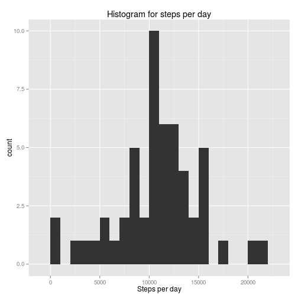
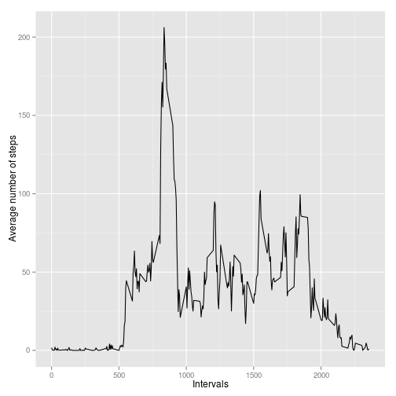
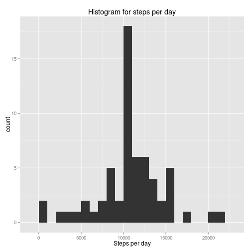
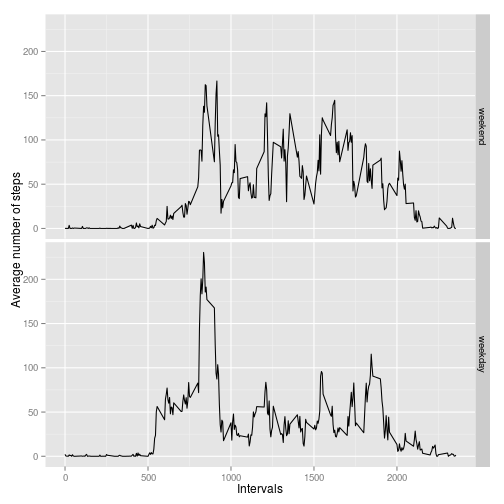

## Loading and preprocessing the data
Here, we will just unzip the .zip file in the repository, and load the resulting *activity.csv* file into the *data* variable.

The *head* command shows that the file was correctly loaded.

```r
unzip('activity.zip')
data <- read.table('activity.csv', sep=',', quote = '"', header=TRUE)
head(data)
```

```
##   steps       date interval
## 1    NA 2012-10-01        0
## 2    NA 2012-10-01        5
## 3    NA 2012-10-01       10
## 4    NA 2012-10-01       15
## 5    NA 2012-10-01       20
## 6    NA 2012-10-01       25
```


## What is mean total number of steps taken per day?
Here, we calculate the number of steps per day. We use the *dplyr* library to do these calculations, which provides a clean interface for these kinds of operations.

```r
library(dplyr)
steps_per_day <- data %>% group_by(date) %>% summarise(steps=sum(steps))
head(steps_per_day)
```

```
## Source: local data frame [6 x 2]
## 
##         date steps
##       (fctr) (int)
## 1 2012-10-01    NA
## 2 2012-10-02   126
## 3 2012-10-03 11352
## 4 2012-10-04 12116
## 5 2012-10-05 13294
## 6 2012-10-06 15420
```

Next, we generate the histogram for the total number of steps taken each day.

```r
library(ggplot2)
qplot(steps_per_day$steps, geom='histogram', binwidth=1000, xlab='Steps per day', main='Histogram for steps per day')
```

 

```r
steps_mean <- mean(steps_per_day$steps, na.rm=TRUE)
steps_median <- median(steps_per_day$steps, na.rm=TRUE)
```

Finally, we calculate the mean and the median for the total number of steps taken. NA values are ignored.

- The mean is **10766.19**.
- The median is **10765**.

## What is the average daily activity pattern?
First, we average the number of steps per interval across all days. NA values are ignored.

```r
steps_per_interval <- data %>% group_by(interval) %>% summarise(steps=mean(steps, na.rm=TRUE))
head(steps_per_interval)
```

```
## Source: local data frame [6 x 2]
## 
##   interval     steps
##      (int)     (dbl)
## 1        0 1.7169811
## 2        5 0.3396226
## 3       10 0.1320755
## 4       15 0.1509434
## 5       20 0.0754717
## 6       25 2.0943396
```

As shown per the time series plotted below, the interval that has the highest average number of steps is **835**, with an average across the days of **206.17** steps.

```r
ggplot(steps_per_interval, aes(interval, steps)) + geom_line() +
  xlab("Intervals") + ylab("Average number of steps")
```

 

## Imputing missing values
There are 2304 missing values in the dataset.
To avoid bias in our calculations, we will fill in these missing values.

The chosen strategy is to use average number of steps per 5 minute interval, as executed below.

```r
data_filled <- data
na_index <- which(is.na(data_filled$steps))

data_filled$steps[na_index] <- steps_per_interval$steps[match(data_filled$interval[na_index], steps_per_interval$interval)]
head(steps_per_interval)
```

```
## Source: local data frame [6 x 2]
## 
##   interval     steps
##      (int)     (dbl)
## 1        0 1.7169811
## 2        5 0.3396226
## 3       10 0.1320755
## 4       15 0.1509434
## 5       20 0.0754717
## 6       25 2.0943396
```

Now, we regenerate the histogram for the total number of steps taken each day, now taking into account the replaced NA values.

```r
steps_per_day_filled <- data_filled %>% group_by(date) %>% summarise(steps=sum(steps))
qplot(steps_per_day_filled$steps, geom='histogram', binwidth=1000, xlab='Steps per day', main='Histogram for steps per day')
```

 

```r
steps_mean_filled <- mean(steps_per_day_filled$steps)
steps_median_filled <- median(steps_per_day_filled$steps)
```

Finally, we recalculate the mean and the median for the total number of steps taken, taking into consideration the replaced NA values.

- The mean is **10766.19**. There is a difference of **0** to the steps mean calculated ignoring NA values.
- The median is **10766.19**. There is a difference of **1.1886792** to the steps median calculated ignoring NA values.

As we can see from the histogram and the mean and median values, filling in the missing values using the strategy decribed above does not alter the results. There is a greater number of observations, obviously, since we filled in those values. This is reflected on the higher counts in the new histogram, compared to the old one. The mean is not altered, and the median remains roughly the same. It is of note that they now have the exact same value.

## Are there differences in activity patterns between weekdays and weekends?
For this part of the exercise, we will continue using the data with the replaced NA values, as it wasn't specified whether to ignore or replace the NA values.

First, we create a new column in out *data_filled* data frame, containing the factor variable indicating whether this day is a regular weekday or a weekend day.

```r
days <- weekdays(as.Date(data_filled$date, '%Y-%m-%d'))
weekend_days_list <- c('Saturday', 'Sunday')
data_filled$weekday <- factor(days %in% weekend_days_list, levels=c(TRUE, FALSE), labels=c('weekend', 'weekday'))
head(data_filled)
```

```
##       steps       date interval weekday
## 1 1.7169811 2012-10-01        0 weekday
## 2 0.3396226 2012-10-01        5 weekday
## 3 0.1320755 2012-10-01       10 weekday
## 4 0.1509434 2012-10-01       15 weekday
## 5 0.0754717 2012-10-01       20 weekday
## 6 2.0943396 2012-10-01       25 weekday
```

Next, we average the number of steps per 5 minute interval, grouped by the new factor variable.

```r
steps_per_weekday_interval <- data_filled %>% group_by(weekday, interval) %>% summarise(steps=mean(steps))
head(steps_per_weekday_interval)
```

```
## Source: local data frame [6 x 3]
## Groups: weekday [1]
## 
##   weekday interval       steps
##    (fctr)    (int)       (dbl)
## 1 weekend        0 0.214622642
## 2 weekend        5 0.042452830
## 3 weekend       10 0.016509434
## 4 weekend       15 0.018867925
## 5 weekend       20 0.009433962
## 6 weekend       25 3.511792453
```

Finally, we make a panel plot to show the time series for the weekdays and the weekend days. As we can see in the plot below, the individual walks more or less the same amount during his waking hours in the weekdays, while for the weekend days, he has a higher amount of steps during the start of the day, then the number of steps decrease until the end of the day.

```r
ggplot(steps_per_weekday_interval, aes(interval, steps)) + geom_line() +
  xlab("Intervals") + ylab("Average number of steps") + facet_grid(weekday ~ .)
```

 
